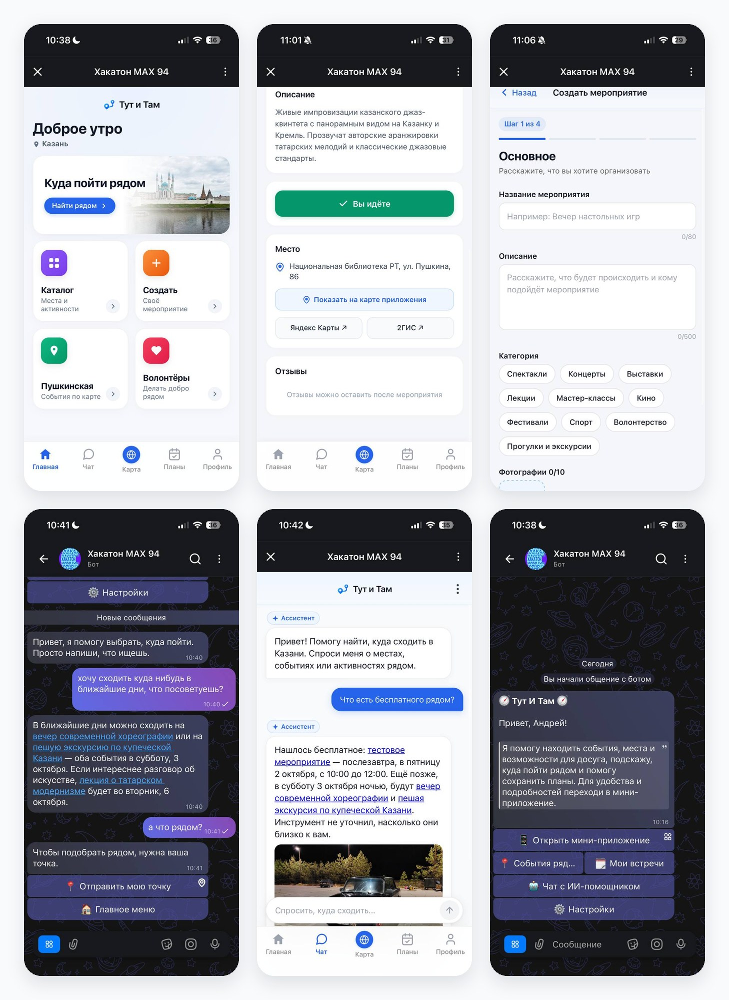
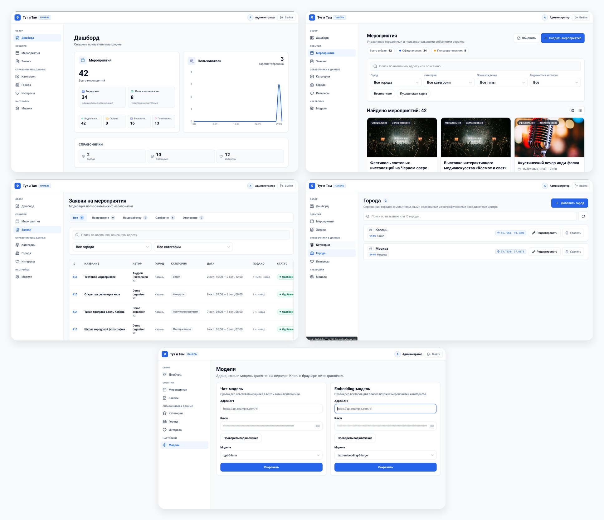
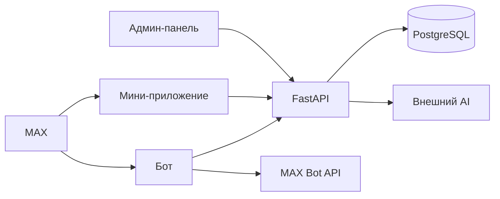

<p align="center">
  
</p>

<h1 align="center">Тут и там</h1>

<p align="center">
  <strong>Досуг рядом, без каталога на весь город</strong><br>
  Бот и мини-приложение MAX показывают, куда пойти сейчас:<br>
  события, места, спорт, парки и волонтёрство.
</p>

<p align="center">
  
  
  
  
  
</p>

<p align="center">
  
</p>

<p align="center">
  
</p>

<p align="center">
  <a href="#запуск-одной-командой">Запуск</a> ·
  <a href="#как-проверить">Проверка</a> ·
  <a href="#что-внутри">Состав</a> ·
  <a href="#переменные-окружения">Окружение</a> ·
  <a href="#остановка-и-повторный-запуск">Остановка</a>
</p>

> Решение для хакатона MAX, трек «Досуг и развлечения».
>
> Бот: https://max.ru/t94_hakaton_max_bot  
> Мини-приложение открывается из бота. Прямой адрес: https://tut-i-tam.goliluha.ru/  
> API: https://tut-i-tam.goliluha.ru/api/health

## Назначение

«Тут и там» отвечает на вопрос «куда пойти рядом», а не предлагает листать городскую афишу. Человек открывает бота в MAX или мини-приложение, видит ближайшее мероприятие и может открыть его на карте, сохранить в планы или спросить ассистента.

Организатор создаёт своё мероприятие, привязывает к нему ссылку-приглашение в чат MAX и при необходимости отменяет событие. Одна ссылка принадлежит одному мероприятию.

## Основной сценарий

1. Человек открывает бота в MAX и нажимает **Start**. Приходит приветствие с меню.
2. Кнопка мини-приложения открывает карту и ленту событий рядом.
3. Карточка показывает время, место, цену и число участников. «Я приду» сохраняет событие в планах.
4. Организатор создаёт мероприятие, вставляет ссылку `https://max.ru/join/...` и нажимает **Привязать**.
5. Участник открывает привязанный чат кнопкой «Чат события».
6. После мероприятия можно оставить отзыв. До начала отзыв не принимается.

## Что внутри

```text
backend/                 FastAPI, SQLAlchemy, Alembic, PostgreSQL
bot/                     бот MAX на TypeScript
frontend/mini-app/       мини-приложение React/Vite
frontend/admin-panel/    админ-панель React/Vite
openapi.yaml             описание API
DATA-API.yaml            обязательные HTTP-проверки
test-data.md             тестовые учётки и тела запросов
```

| Часть | За что отвечает |
| --- | --- |
| **Бот** | Приветствие, меню, события рядом, мои встречи, настройки, ассистент |
| **Мини-приложение** | Карта, карточка события, планы, создание мероприятия, чат и отзывы |
| **API** | Каталог, участие, свои события, привязка чата, карта, ассистент, админка |
| **PostgreSQL** | Города, события, участие, отзывы, чаты, векторы для подборки |
| **Админ-панель** | Официальные события, модерация, города, интересы, AI-провайдеры |



Внешний AI нужен только для ассистента и векторной подборки. Каталог, карта, планы и привязка чата работают без него. Адрес и ключ AI задаются в админ-панели или переменными окружения и в репозиторий не входят.

## Запуск одной командой

Нужны Docker Engine и Docker Compose. Сборка без загрузки базовых образов занимает меньше пяти минут.

```bash
git clone https://github.com/KroJIak/tut-i-tam-max-bot.git
cd tut-i-tam-max-bot
cp .env.example .env
docker compose up -d --build
```

В `.env` перед запуском замените три значения:

| Переменная | Что поставить |
| --- | --- |
| `BOT_TOKEN` | токен бота из кабинета MAX |
| `ADMIN_PASSWORD` | пароль входа в админ-панель |
| `ACCESS_CODE` | контрольное слово, если `ACCESS_CODE_ENABLED=true` |

Первый запуск применяет миграции и загружает демо-каталог Казани. Пока контейнер `db-init` не завершился успешно, API не стартует.

### Адреса после запуска

| Что | Адрес |
| --- | --- |
| Мини-приложение | http://localhost:8081 |
| Админ-панель | http://localhost:8080 |
| API | http://localhost:8081/api/health |
| Swagger | http://localhost:8081/api/docs |
| Adminer | http://localhost:8082 |

Порты задаются в `.env`: `EXTERNAL_MINI_APP_PORT`, `EXTERNAL_ADMIN_PANEL_PORT`, `EXTERNAL_ADMINER_PORT`.

Проверка:

```bash
docker compose ps
curl http://localhost:8081/api/health
```

Ожидаемый ответ: `{"status":"ok"}`.

На Windows используйте Docker Desktop. Команды те же, кроме `cp`: в PowerShell это `copy .env.example .env`.

## Как проверить

### Автоматический сценарий API

Файл `DATA-API.yaml` описывает обязательные проверки. Локально их можно повторить вручную. Заголовок тестового пользователя:

```http
Authorization: tma local-development:910001:Jury:ru-ru
```

```bash
curl http://localhost:8081/api/health
curl http://localhost:8081/api/v1/local-dev-auth
curl -H 'Authorization: tma local-development:910001:Jury:ru-ru' \
  http://localhost:8081/api/v1/cities
```

Дальше сценарий из `DATA-API.yaml`:

1. `POST /api/recommendations/app/nearby` с точкой Казани возвращает событие.
2. `POST /api/v1/events` создаёт мероприятие автора.
3. `POST /api/v1/events/{id}/chat` со ссылкой `https://max.ru/join/...` привязывает чат.
4. Та же ручка с адресом `https://example.com/...` отвечает `422` и `invalid_chat_link`.
5. Заголовок `Authorization: tma nope` отвечает `401`.
6. `DELETE /api/v1/events/{id}` удаляет созданное мероприятие.

Тела запросов и вторая учётка лежат в `test-data.md`. Описание методов — в `openapi.yaml`.

## Переменные окружения

Рабочие значения живут только в `.env`. В репозитории — `.env.example` без токенов и паролей.

| Переменная | Зачем |
| --- | --- |
| `BOT_TOKEN` | токен бота MAX |
| `BOT_UPDATE_TRANSPORT` | `long-polling` локально, `webhook` на публичном адресе |
| `BOT_WEBHOOK_DOMAIN`, `BOT_WEBHOOK_SECRET` | нужны только для webhook |
| `POSTGRES_DB`, `POSTGRES_USER`, `POSTGRES_PASSWORD` | база |
| `ACCESS_CODE_ENABLED`, `ACCESS_CODE` | контрольное слово на вход в бота |
| `ADMIN_PASSWORD` | пароль админ-панели |
| `ADMIN_ACCESS_TTL`, `ADMIN_REFRESH_TTL` | срок сессии администратора, например `1d` и `7d` |
| `LOCAL_DEV_AUTH_ENABLED` | локальный вход в мини-приложение без подписи MAX |
| `LOCAL_DEV_AUTH_HOSTS` | хосты, которым этот вход разрешён |
| `FALLBACK_LOCALE` | язык по умолчанию, `ru-ru` |
| `CHAT_PROVIDER_BASE_URL`, `CHAT_PROVIDER_API_KEY`, `CHAT_PROVIDER_MODEL` | внешний чат-провайдер ассистента |
| `EMBEDDING_PROVIDER_BASE_URL`, `EMBEDDING_PROVIDER_API_KEY`, `EMBEDDING_PROVIDER_MODEL` | внешние эмбеддинги подборки |
| `MINI_APP_PUBLIC_URL` | публичный адрес мини-приложения для кнопки бота |
| `EXTERNAL_ADMIN_PANEL_PORT` | порт админ-панели, по умолчанию `8080` |
| `EXTERNAL_MINI_APP_PORT` | порт мини-приложения и API, по умолчанию `8081` |
| `EXTERNAL_ADMINER_PORT` | порт Adminer, по умолчанию `8082` |

База наружу не публикуется. К ней ходит Adminer внутри сети Compose.

## Данные

Демо-каталог Казани — города, категории, официальные события и районы карты — появляется при первом запуске вместе с миграциями. Отдельный файл загрузки не нужен.

Свои события пользователя скрыты, пока модератор их не одобрит. Привязанный чат хранится как ссылка-приглашение и виден участникам. Одна ссылка принадлежит одному мероприятию: повторная привязка к тому же событию проходит, к другому — нет. Отзыв принимается только после начала мероприятия.

Тестовые учётки и тела запросов описаны в `test-data.md`. Событие, которое создаёт сценарий `DATA-API.yaml`, удаляется последним шагом.

## Порядок работы с тестовыми данными

1. Поднять стенд командой `docker compose up -d --build` и дождаться завершения `db-init`.
2. Проверять API заголовком `Authorization: tma local-development:910001:Jury:ru-ru`. Для этого в `.env` должны быть `LOCAL_DEV_AUTH_ENABLED=true` и хост стенда в `LOCAL_DEV_AUTH_HOSTS`.
3. Пройти шаги `DATA-API.yaml`. Последний шаг удаляет созданное мероприятие.
4. Демо-каталог при этом остаётся.

## Ожидаемое поведение

| Действие | Результат |
| --- | --- |
| Start в боте | приветствие и меню |
| Мини-приложение из бота | карта и события Казани |
| «Я приду» | событие в планах, повтор не создаёт вторую запись |
| Ссылка `max.ru/join/...` | чат привязан, участник может его открыть |
| Любой другой адрес | `422 invalid_chat_link` |
| Та же ссылка у другого события | `409 chat_already_used` |
| Отмена своего события | событие удалено |
| Отмена чужого события | `404` |
| Отзыв до начала | отказ |

## Ограничения

- Мини-приложение открывается из бота. Прямой заход по адресу без запуска из MAX не является основным сценарием.
- Привязка сохраняет ссылку-приглашение и не проверяет, что бот уже состоит в чате.
- Ассистент и векторная подборка работают, когда в админ-панели задан внешний AI-провайдер. Каталог, карта, планы и чат от него не зависят.
- Внешний AI нельзя поднять внутри Docker: нужен его адрес и ключ.
- Контрольное слово, пароль админки и токен бота передаются только на служебном слайде.

## Остановка и повторный запуск

Остановить, данные сохранить:

```bash
docker compose stop
```

Запустить снова:

```bash
docker compose start
```

Пересоздать контейнеры и сохранить базу с фото:

```bash
docker compose down
docker compose up -d
```

Удалить контейнеры вместе с базой и фото, затем собрать заново:

```bash
docker compose down -v
docker compose up -d --build
```

## Зависимости

Версии зафиксированы в `backend/requirements.txt`, `bot/package-lock.json`, `frontend/mini-app/package-lock.json` и `frontend/admin-panel/package-lock.json`.

Локальный состав: PostgreSQL с pgvector, API, одноразовая миграция, бот, мини-приложение, админ-панель и Adminer.
