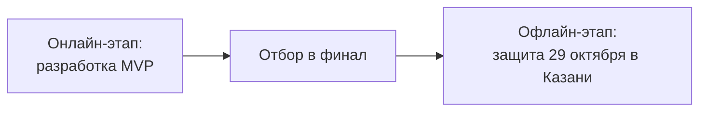

# Описание кейса MAX

> [!quote] Формулировка трека
> Предложите цифровое решение для поиска и организации досуга — от событий и волонтерства до туризма и спорта.

Трек: **«Досуг и развлечения»**.

## Аннотация

В рамках трека «Досуг и развлечения» предстоит самостоятельно определить конкретного пользователя и проблемный участок его пути в сфере досуга, где цифровой продукт может дать полезный и заметный результат.

Нужно изучить потребности аудитории и разработать [[max-platform|чат-бота или мини-приложение в MAX]], которое решает выбранную проблему. Нужно показать, почему она значима, какую ценность решение дает пользователю и как продукт можно [[scaling|масштабировать]].

## Содержание

| Раздел | Заметка |
| --- | --- |
| Введение | [[introduction]] |
| Постановка задачи | [[task]] |
| Ограничения | [[constraints]] |
| Рекомендации | [[recommendations]] |
| Формат сдачи | [[submission]] |
| Критерии оценки | [[evaluation]] |
| Дополнительная информация | см. ниже |

### Дополнительная информация

- [[max-platform|Сценарии работы платформы MAX]]
- [[problem-formulation|Как найти и сформулировать проблему]]
- [[from-problem-to-solution|От проблемы к решению]]
- [[official-data|Работа с официальными данными]]
- [[scaling|Как продумать масштабирование]]
- [[pilot-launch|Как продумать пилотный запуск]]
- [[sources|Источники информации]]

## Этапы работы

Подробности этапов — в [[task]].
