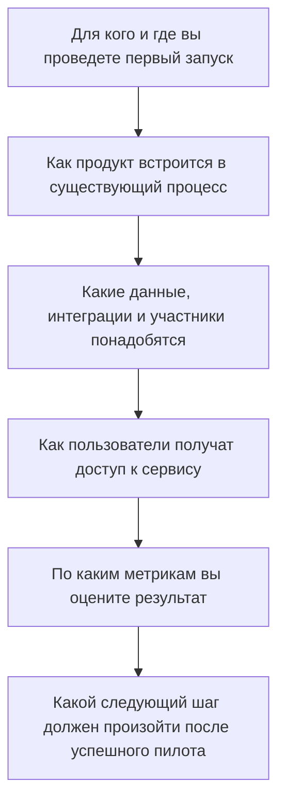

# Как продумать пилотный запуск

Пилот — это первый ограниченный запуск продукта, который позволяет проверить, действительно ли решение дает заявленную пользовательскую ценность.

Определите:

- для кого и где вы проведете первый запуск
- как продукт встроится в существующий процесс
- какие данные, интеграции и участники понадобятся
- как пользователи получат доступ к сервису
- по каким метрикам вы оцените результат
- какой следующий шаг должен произойти после успешного пилота

См. также: [[task]], [[scaling]], [[evaluation]].
